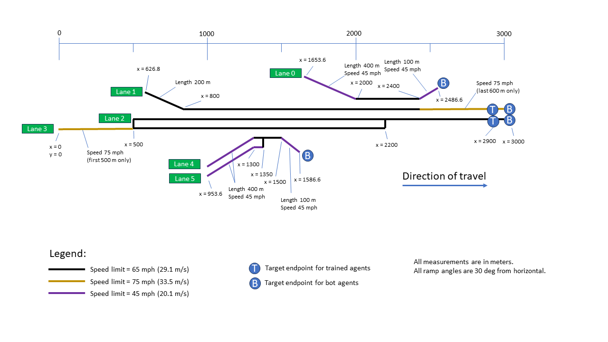

# CDA1 (Bridgit)
**Multiple AI agents driving automated vehicles.**

This project builds on the [CDA0 project](https://github.com/TonysCousin/cda0) which trained an AI automated vehicle to drive a simple highway ramp merge scenario in traffic.
In this project we will extend the environment model to handle a generic vehicle model for each of the vehicles in the scenario.
Therefore, each vehicle is capable of running a different control algorithm, which could be an AI agent or something else.
This new environment could be used to duplicate the CDA0 project by using that AI agent in one of the vehicles and its "neighbor vehicle" algo in the others.
However, the goal here is to train an AI agent to drive all of the vehicles at once, and have it learn something about safe driving and anticipating others' actions in the process.
Again, as in CDA0, there is no communication between vehicles, and all sensors are perfect.

This project is built on the [Ray](https://www.ray.io) platform using the [PyTorch](https://pytorch.org) framework on Ubuntu Linux.

## Project Description
A statement of the detailed software requirements [can be found here](docs/cda1_rqmts.txt).

Training and testing is currently being performed with the _Roadway B_ test track, shown here. It is a 3 km long freeway segment with several merges and lane drops, to exercise lane change maneuvering and, eventually, cooperative behavior.

## Installation & Running
To install this software, follow these steps:
0. It is recommended to create a virtual environment (venv or conda) in order to be assured the supporting libraries are exactly what you need, and do not interfere with othe projects. In this case, create your environment with Python 3.10 (Ray currently does not fully support Python 3.11). Then activate the environment you have created.
1. Clone this repo (e.g. `git clone https://github.com/TonysCousin/cda1 .`), then cd into the directory where it is located
2. `pip install -r requirements1.txt`
3. `pip install -r requirements2.txt`
My apologies for the two requirements files, but the global option used in the first prevents the Ray installation (in the second file), and I'm not enough of a pip expert to resolve that conflict in a single requirements file.

## License & Authorship
This software is published under the [Apache 2.0 open source license](LICENSE), and can be used and distributed according to the terms of that license.
The software was created by John Stark.

## Project Progress
Latest code ready for public use is on the _master_ branch (not much there now).

Latest working code is on the _develop_ branch. It may be lacking complete functionality, contain experimental work, or be somewhat inconsistent, but is generally sound.

In-work features & fixes are on other branches off of _develop_.

**8/21/23** - Just getting started. New definition docs & skeleton code should appear shortly.

**10/5/23** - A single agent is in training on the _train_ branch.
It is learning to drive with several other "bot" vehicles (who have simple, hard-coded observations and control logic). 
The environment has been generalized quite a bit over that found in cda0, such that it provides abstract interfaces for vehicle models and vehicle control objects, and can run any number and combination of various vehicle types.
In theory, it should be able to support multiple NN-controlled vehicles, but that has not yet been tested.

The following roadmap outlines where this project is headed:
- Part 1:  Train a single agent to drive the new track to suitable destinations with several bots attempting to do the same thing.
- Part 2:  Expand the training to include several instances of the agent (replacing some bots) as pseudo-multi-agent training (iterative).
- Part 3:  True multi-agent training, with several untrained agents (same policy) learning simultaneously using Ray multi-agent facilities.
- Part 4:  Multi-agent training for two policies in a single vehicle, one for planning and one for control.

**11/12/23** - Structuring the policy NN as a simple MLP prevents it from learning satisfactorily. Starting to looking at alternative structures.
